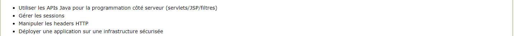
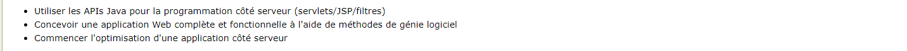
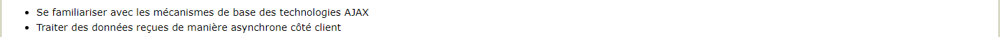

# l'UE : 
## Objectifs Pédagogiques des TPs
### TP 2 : Programmation Java côté serveur

### TP 3 : Design patterns côté serveur en Java

### TP 4 : Web APIs (programmation REST)

### TP 5 : Programmation côté client (requêtage asynchrone)

### TP 6 : Web Performance

### TP 7 : Optimisation d'une Single-Page Application

### ![Plus de détails sur les différents TPs dans le repertoire "sujetsTps"]

# Préambule

TPs Réalisés par :
<ul>
<li> MARTINEZ Jennifer 11502280 </li>
<li> BURDIN Kevin 11507706 </li>
</ul>

Notre VM : 192.168.75.49

# TP2 & TP3

<ul>
<li> <b>Déploiement à l'adresse : </b> 192.168.75.49/api/v1 </li>
<li> <b>Description : </b> les TP2 et 3 réalisés entièrement. Pour la gestion du cache, nous avons opté pour l'utilisation des requêtes HTTP.</li>
<li> Code source disponible dans le répertoire v1. </li>
</ul>

# TP4

<ul>
<li> <b>Déploiement à l'adresse : </b> 192.168.75.49/api/v2 </li>
<li> <b>Description : </b>
    <ul>
    <li> Arborescence des URLs mise en place. Routage réalisé à l'aide d'un filtre "Routeur.java", dans le répertoire des servlet. </li>
    <li> Ajout de liens hypermédia non fait. </li>
    <li> Dialogue avec l'api : ajouter l'extension .json ou .xml à la fin de chaque url afin d'avoir la ressource correspondante au format correspondant. Par défaut : la page html du client. </li>
    <li> Exemples : http://192.168.75.49/v2/groupes.json pour accéder à la liste des groupes au format json,  http://192.168.75.49/v2/groupes/nomDuGroupe.json pour accéder au groupe "nomDuGroupe", etc... </li>
    <li> Documentation Swagger disponible dans le répertoire "v2".</li>
    <li> Code source disponible dans le répertoire v2. </li>
    </ul>
</li>
</ul>

# TP5 & TP7

<ul>
<li> <b>Deploiement à l'adresse : </b> 192.168.75.49 </li>
<li> <b>Description : </b> 
    <ul>
    <li> <b> API Utilisée : </b> http://192.168.75.13:8080/v2/ </li>
    <li> <b> Fonctionnalités implémentées du TP5 : </b>
        <ul>
        <li> Connexion / Déconnexion</li>
        <li> Création d'un groupe, billet, commentaire </li>
        <li> Routage vers les différentes vues de la SPA </li>
        <li> Les templates des différents éléments de l'API </li>
        <li> Les mocks pour simulter les différents éléments de l'API </li>
        </ul>
    </li>
    <li> <b> Le TP7 : </b>
        <ul>
        <li> Déploiement sur Tomcat : <ul><li> HTML :  31 ms </li><li> AppShell : 0 ms </li><li> CRP : 244 ms </li></ul></li>
        <li> Déploiement sur Nginx : <ul><li> HTML :  24 ms </li><li> AppShell : 0 ms </li><li> CRP : 186 ms </li></ul></li>
        <li> Amélioration : <ul><li> HTML :  22,5 % </li><li> AppShell : 0 % </li><li> CRP : 23,77 % </li></ul></li>
        </ul>
    </li>
    </ul>
</li>
<li> Code source disponible dans le répertoire client. </li>
</ul>
