# Détails des TPs 
## TP 2 : Programmation Java côté serveur
### Objectifs pédagogiques

### Détails du TP
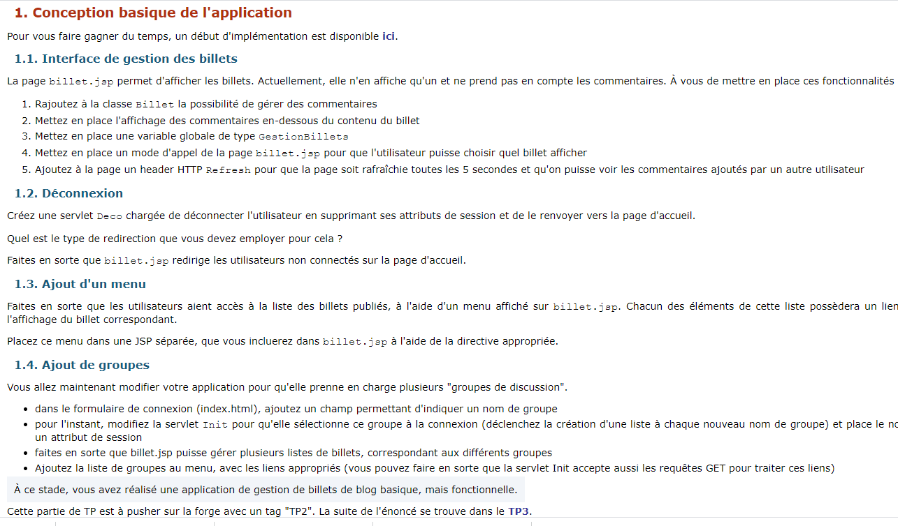
## TP 3 : Design patterns côté serveur en Java
### Objectifs pédagogiques

### Détails du TP
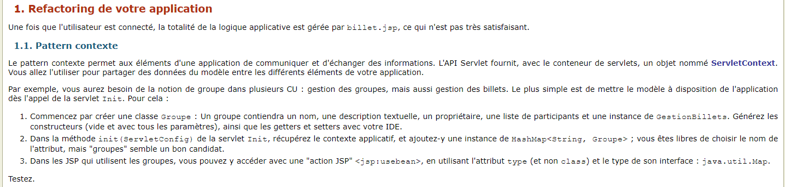
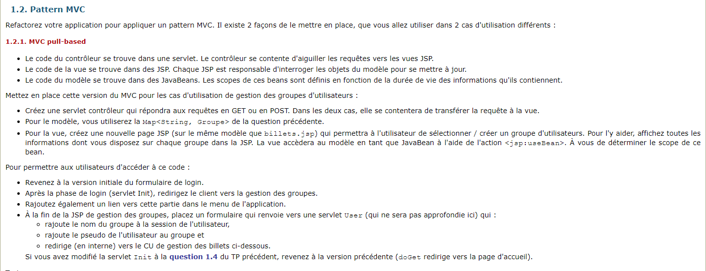
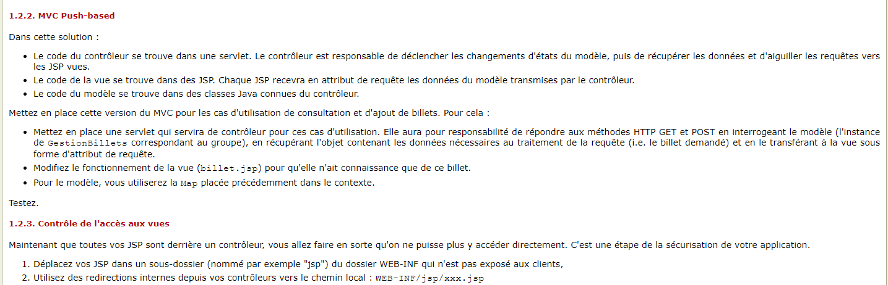
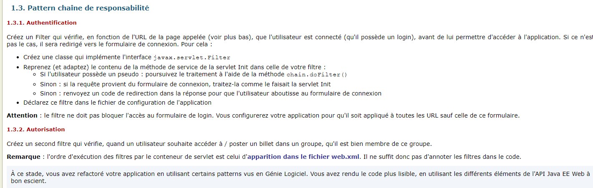
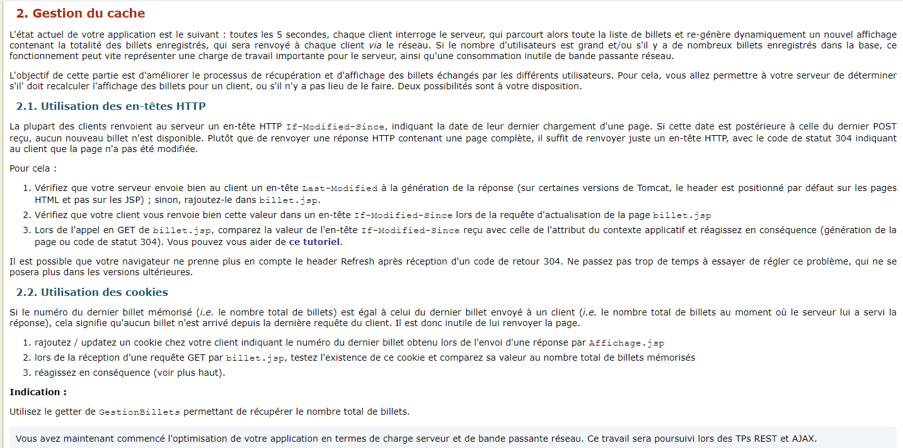
## TP 4 : Web APIs (programmation REST)
### Objectifs pédagogiques
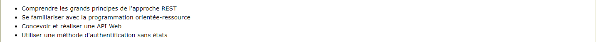
### Détails du TP
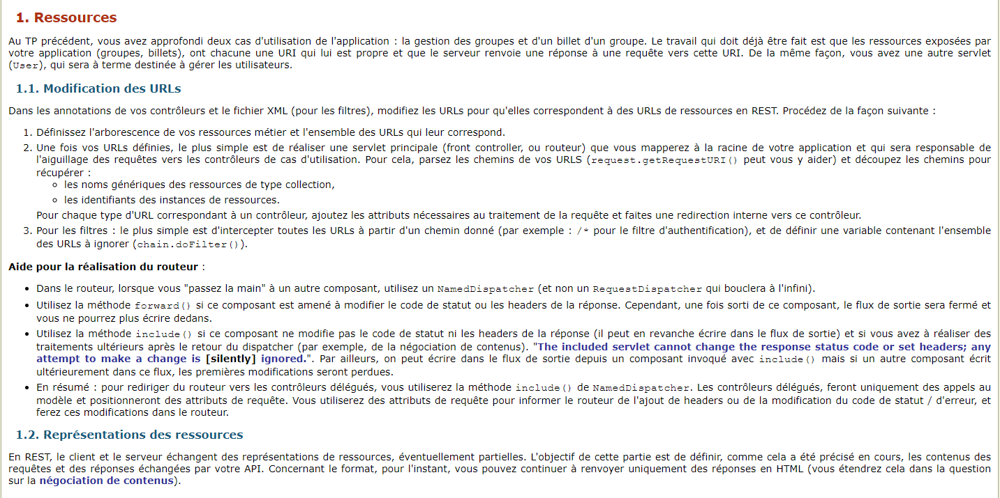
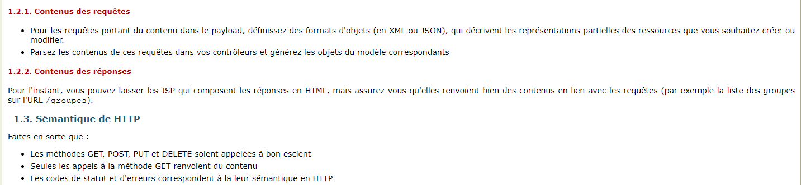
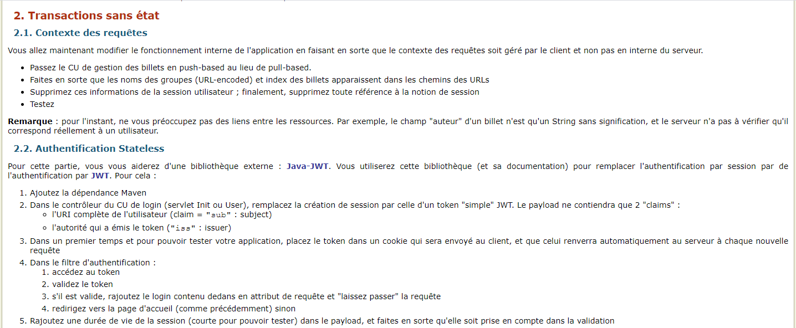
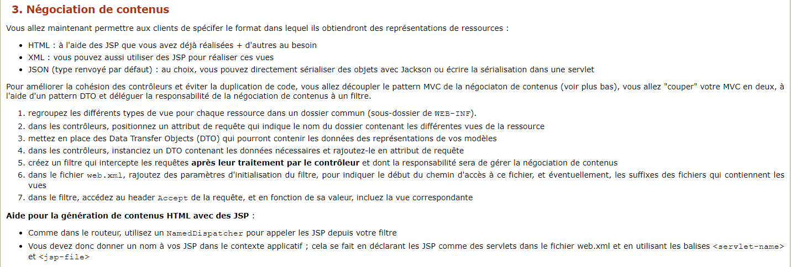
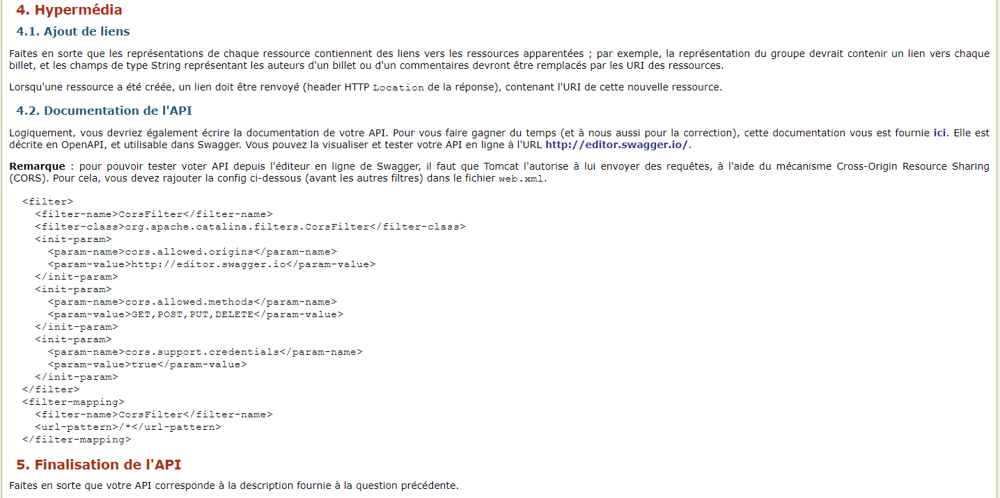
## TP 5 : Programmation côté client (requêtage asynchrone)
### Objectifs pédagogiques

### Détails du TP
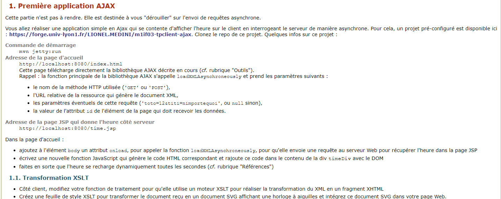
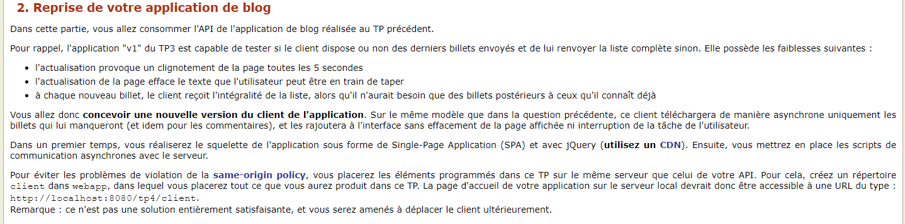
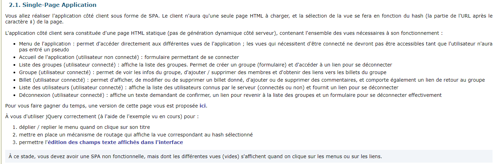
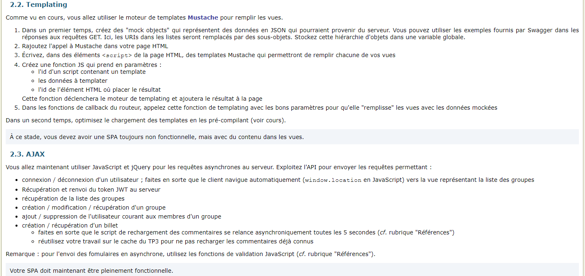
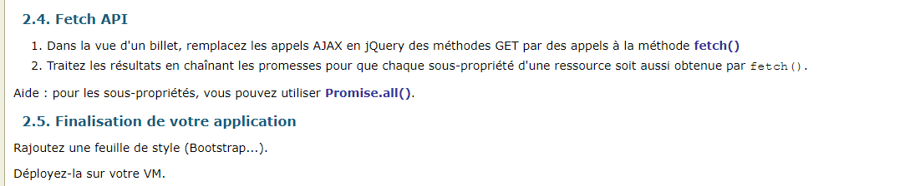
## TP 6 : Web Performance
### Objectifs pédagogiques

## TP 7 : Optimisation d'une Single-Page Application
### Objectifs pédagogiques

### Détails du TP
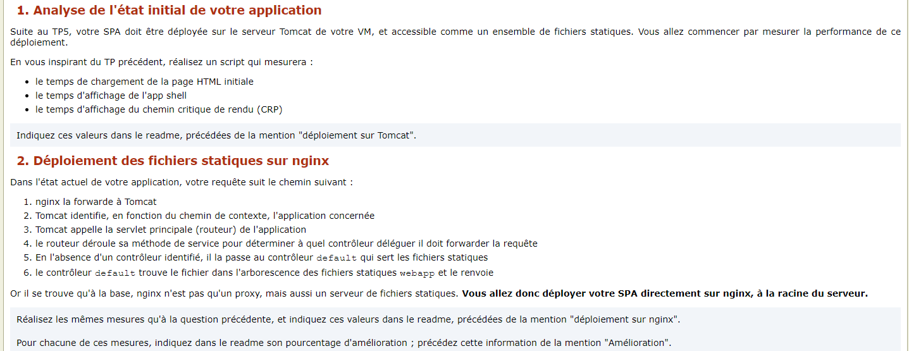
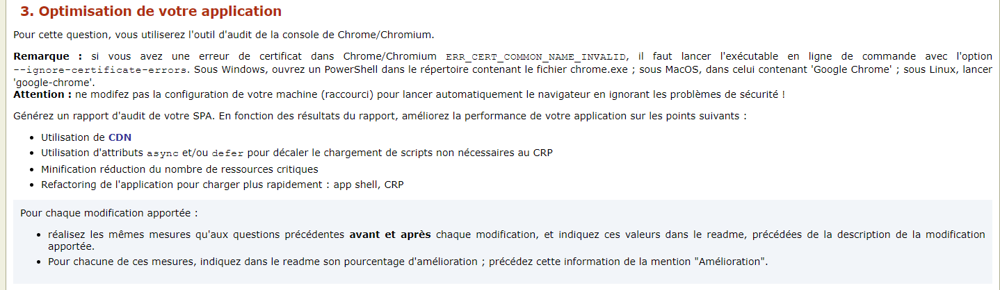
