# Les différents TPs
+ [TP 1 : technologies côté serveur](#tp-1--technologies-côté-serveur)
+ [TP 2 : Programmation Java côté serveur](#tp-2--programmation-java-côté-serveur)
+ [TP 3 : Design patterns côté serveur en Java](#tp-3--design-patterns-côté-serveur-en-java)
+ [TP 4 : Web APIs (programmation REST)](#tp-4--web-apis-programmation-rest)
+ [TP 5 : Programmation côté client (requêtage asynchrone)](#tp-5--programmation-côté-client-requêtage-asynchrone)
+ [TP 6 : Web Performance](#tp-6--web-performance)
+ [TP 7 : Optimisation d'une Single-Page Application](#tp-7--optimisation-d-une-single-page-application)
# Détails des TPs
## TP 1 : technologies côté serveur
### Objectifs pédagogiques
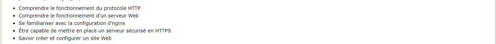
### Détails du TP
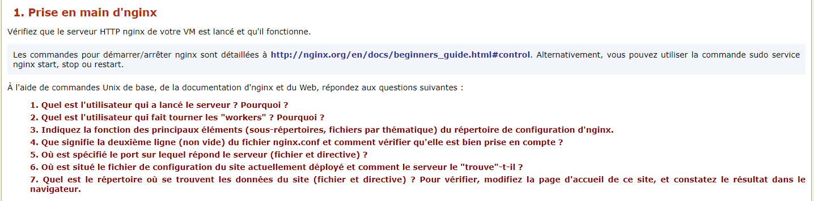
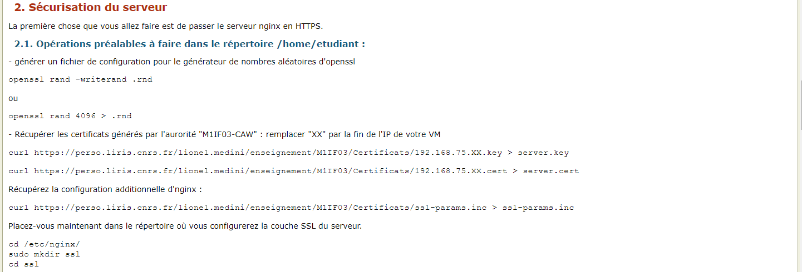
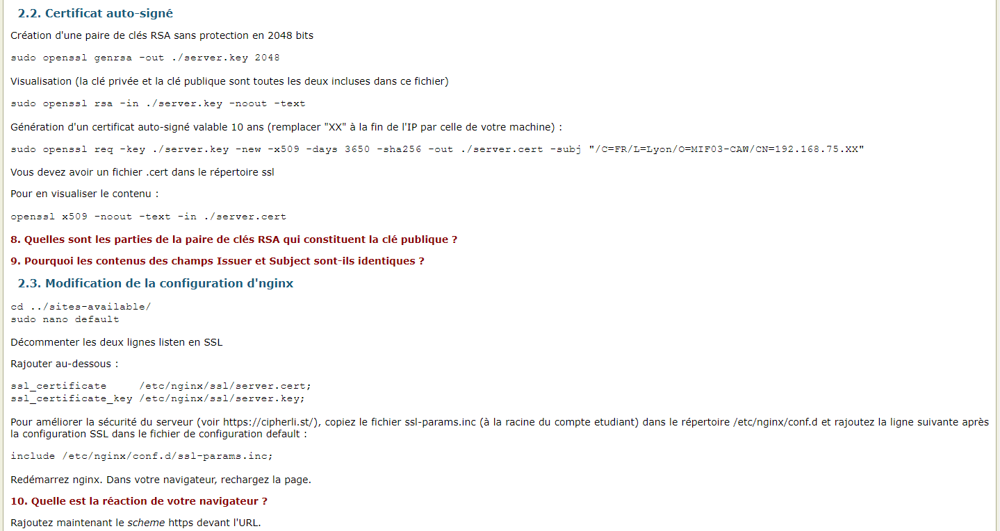
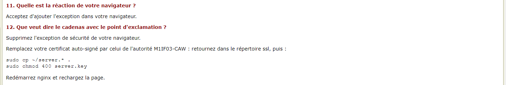
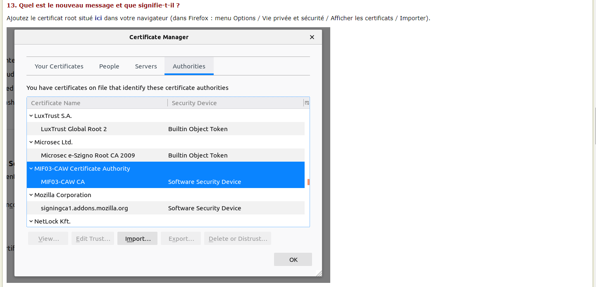
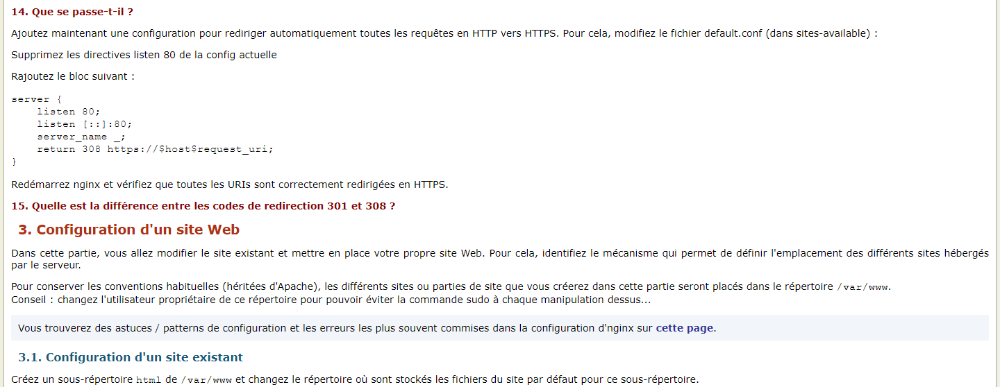
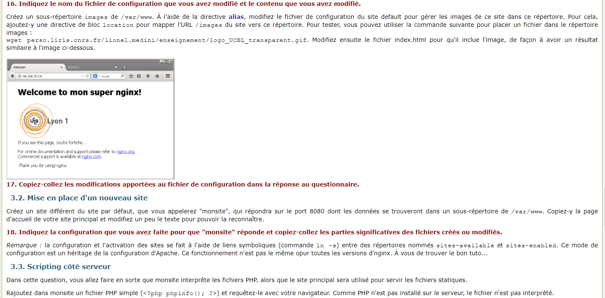
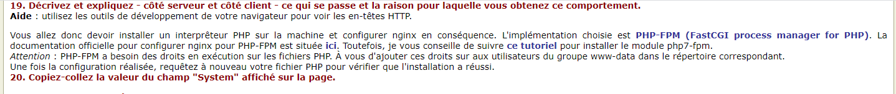
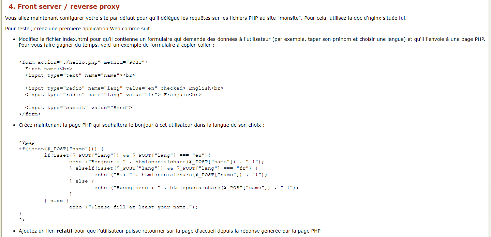
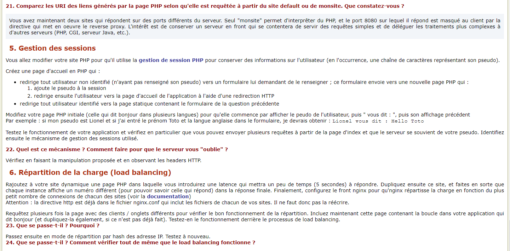
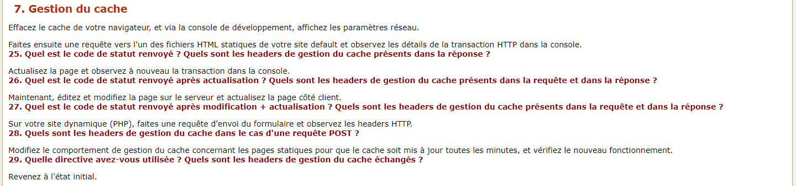
## TP 2 : Programmation Java côté serveur
### Objectifs pédagogiques

### Détails du TP

## TP 3 : Design patterns côté serveur en Java
### Objectifs pédagogiques

### Détails du TP

## TP 4 : Web APIs (programmation REST)
### Objectifs pédagogiques

### Détails du TP

## TP 5 : Programmation côté client (requêtage asynchrone)
### Objectifs pédagogiques

### Détails du TP

## TP 6 : Web Performance
### Objectifs pédagogiques

### Détails du TP
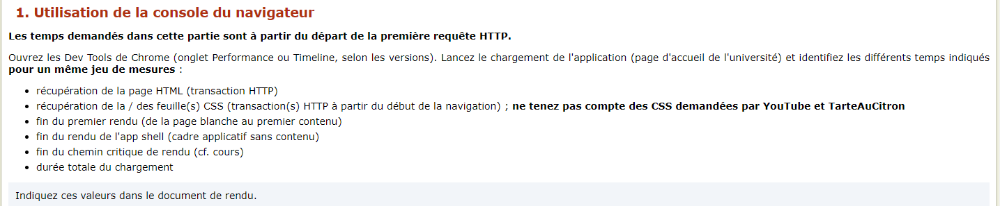
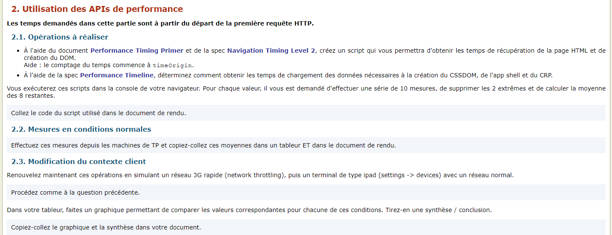
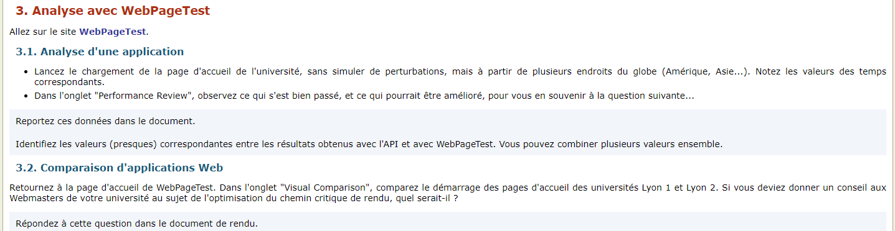

## TP 7 : Optimisation d'une Single-Page Application
### Objectifs pédagogiques

### Détails du TP

